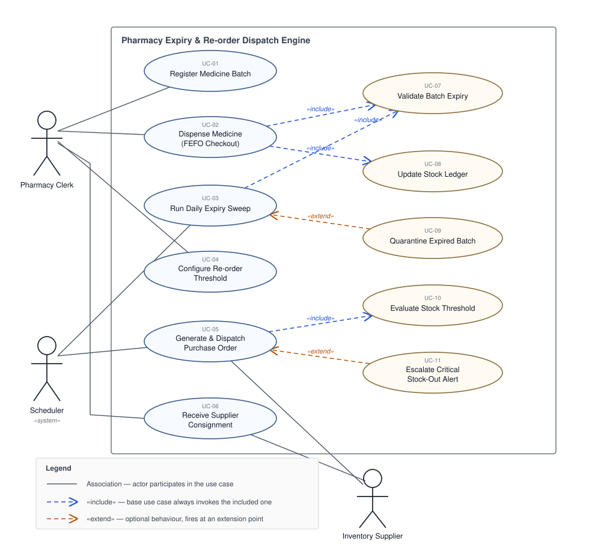

# Lab 1 — Requirements Engineering & UML Use-Case Modelling

**PES University · Dept. of CSE · Software Engineering**

| | |
|---|---|
| **Student** | Rohan May Suresh |
| **SRN** | PES1UG24CS383 |
| **Problem Statement** | **#15 — Pharmacy Expiry & Re-order Dispatch Engine** |
| **Domain** | Healthcare & Telemedicine |

---

## 1. Deliverables

The three artefacts required by the lab handout, in the formats it specifies:

| # | Handout requirement | Submitted file |
|---|---|---|
| 1 | Requirements Table (**Word/Excel**) — exactly 5 FRs and 2 NFRs with Req ID, Type, Description, Priority, Acceptance Criteria, Rationale | **[`Requirements_Table.docx`](Requirements_Table.docx)** |
| 2 | UML Use-Case Diagram (**PDF**) — all actors and use cases, at least one `«include»` / `«extend»` | **[`Use_Case_Diagram.pdf`](Use_Case_Diagram.pdf)** |
| 3 | Use-Case Flow Document (**Word, one page**; exported to PDF per step 7) | **[`Use_Case_Flow.docx`](Use_Case_Flow.docx)** · **[`Use_Case_Flow.pdf`](Use_Case_Flow.pdf)** |

### Supporting files

| File | Purpose |
|---|---|
| [`requirements.md`](requirements.md) | Markdown mirror of the requirements table, so it renders directly on GitHub |
| [`use-case-flow.md`](use-case-flow.md) | Markdown mirror of the use-case flow |
| [`use-case-diagram.svg`](use-case-diagram.svg) | Vector source of the diagram, embedded below |
| [`use-case-diagram.puml`](use-case-diagram.puml) | PlantUML source, for regenerating the diagram |

### Handout checklist

| Requirement | Status |
|---|---|
| Exactly 5 FRs (FR-001 given) and 2 NFRs (NFR-001 given) | ✔ FR-001…FR-005, NFR-001…NFR-002 |
| All six columns, `"The system shall…"` phrasing, measurable pass/fail criteria | ✔ |
| At least 3 actors | ✔ 3 — Pharmacy Clerk, Inventory Supplier, Scheduler |
| At least 5 use cases, labelled UC-01… | ✔ 11 — UC-01 to UC-11 |
| At least one `«include»` or `«extend»` | ✔ 4 `«include»`, 2 `«extend»` |
| Main success scenario + at least one alternate flow | ✔ 10 steps + alternate flow 6a |
| Use-case flow fits one page | ✔ |

---

## 2. Problem Context & Overview

Hospital pharmacies need an automated stock management engine that tracks batch expiry dates, generates **First-Expired-First-Out (FEFO)** dispensing lists, and triggers automated purchase orders when stock hits a threshold.

The engine sits between the dispensing counter and the supplier. It holds every medicine as a set of *batches*, each with its own expiry date, so a stock figure is never just a number — it is a queue ordered by expiry. Three things follow from that model:

- **Dispensing** must always draw from the batch closest to expiry (FEFO), so stock is consumed before it ages out.
- **Expiry** is a date-driven event with no human trigger behind it, so the engine sweeps stock daily, warns on near-expiry batches and quarantines those already expired.
- **Re-ordering** must be measured against *dispensable* stock only — quarantined batches sit on the shelf but cannot fill a prescription, and must not mask a shortage.

### Actors

| Actor | Kind | Responsibility |
|---|---|---|
| **Pharmacy Clerk** | Primary, human | Registers incoming batches, dispenses medicine at checkout, configures per-item re-order thresholds, receives supplier consignments. |
| **Inventory Supplier** | Secondary, external | Receives dispatched purchase orders and delivers the consignment against them. |
| **Scheduler** | Secondary, system / time | Initiates the daily expiry sweep and the post-movement threshold evaluation. Modelled as an actor because these flows are time-triggered, not user-triggered. |

---

## 3. UML Use-Case Diagram



### Relationships modelled

**`«include»`** — behaviour the base use case *always* performs, factored out because more than one base needs it, or because it is a distinct responsibility:

| Base use case | includes | Why |
|---|---|---|
| UC-02 Dispense Medicine | UC-07 Validate Batch Expiry | Every dispense re-checks the picked batch against today's date; the same check is reused by the sweep. |
| UC-02 Dispense Medicine | UC-08 Update Stock Ledger | Every dispense writes the movement and its audit entry (NFR-002). |
| UC-03 Run Daily Expiry Sweep | UC-07 Validate Batch Expiry | The sweep is a bulk application of the same expiry check. |
| UC-05 Generate & Dispatch Purchase Order | UC-10 Evaluate Stock Threshold | A purchase order is only ever raised off a threshold evaluation. |

**`«extend»`** — optional behaviour that fires only when a condition holds at a defined extension point:

| Extending use case | extends | Extension point / condition |
|---|---|---|
| UC-09 Quarantine Expired Batch | UC-03 Run Daily Expiry Sweep | Only when the sweep finds a batch whose expiry date has passed. A sweep over healthy stock completes without it. |
| UC-11 Escalate Critical Stock-Out Alert | UC-05 Generate & Dispatch Purchase Order | Only when dispensable stock has already reached zero — a normal below-threshold re-order does not escalate. |

### Re-rendering the diagram

`Use_Case_Diagram.pdf` is the submitted artefact. The vector source and its PlantUML equivalent are provided for regeneration:

```bash
java -jar plantuml.jar -tsvg use-case-diagram.puml
```

`use-case-diagram.puml` can also be pasted straight into <https://www.plantuml.com/plantuml> to render in the browser.

---

## 4. Requirements at a Glance

| ID | Summary | Priority |
|---|---|---|
| FR-001 | Enforce FEFO picking order at checkout | High |
| FR-002 | Capture and validate batch attributes at intake | High |
| FR-003 | Daily expiry sweep — flag near-expiry, quarantine expired | High |
| FR-004 | Per-item re-order threshold, re-evaluated on every movement | Medium |
| FR-005 | Purchase-order lifecycle tracking and receipt reconciliation | Medium |
| NFR-001 | Auto-generate and dispatch purchase orders — latency and security under peak load | High |
| NFR-002 | Immutable 5-year audit trail; 99.5% availability in operating hours | High |

Full descriptions, acceptance criteria and rationale: **[`Requirements_Table.docx`](Requirements_Table.docx)** · [`requirements.md`](requirements.md)
