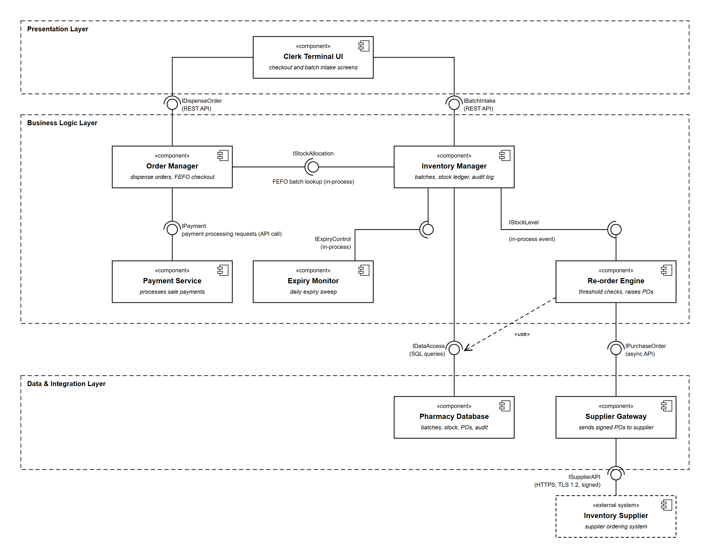

# Lab 3 — Component Modelling & Architectural Pattern Selection

**Student:** Rohan Suresh · **SRN:** PES1UG24CS383
**Problem Statement:** #15 — Pharmacy Expiry & Re-order Dispatch Engine

## Submission

**[`Lab3_PES1UG24CS383_G.pdf`](Lab3_PES1UG24CS383_G.pdf)** — component diagram and the one-page architecture justification.

| File | Content |
|---|---|
| [`component-diagram.png`](component-diagram.png) | UML component diagram (export) |
| [`component-diagram.svg`](component-diagram.svg) | Same diagram, vector source |

## Summary

**Architecture:** Layered — Presentation, Business Logic, Data & Integration.

- **8 components** (Order Manager and Payment Service given) plus the external Inventory Supplier
- **9 interfaces** in ball-and-socket notation, labelled with type (REST API, in-process call, SQL, HTTPS/TLS), plus one «use» dependency
- Given interface included: Order Manager → Payment Service, *payment processing requests*
